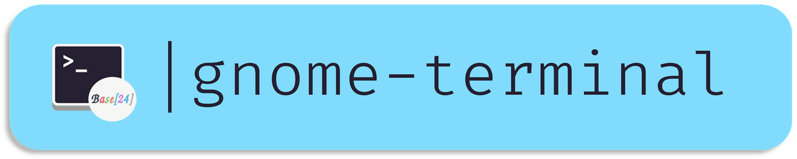

[](../../)
[](https://www.codacy.com/manual/Base24/base24-gnome-terminal)
[](../../)
[](../../issues)
[](/LICENSE.md)
[](../../commits/master)
[](../../commits/master)

# base24-gnome-terminal



Base 24 themes for Gnome Terminal https://help.gnome.org/users/gnome-terminal/stable/

**Find themes under [output/schemes](output/schemes)**

## Installation
Firstly, make sure there is a default profile in your Gnome terminal
preferences. To check this, open preferences, then from the "Preferences"
menu go to profiles and ensure one of the profiles is selected as the profile
to use when launching a new terminal. Then clone the repo and execute the
scheme file of your choosing:

```bash
git clone https://github.com/Base24/base24-gnome-terminal.git ~/.config/base24-gnome-terminal
.config/base24-gnome-terminal/output/schemes/base24-one-dark.sh
```

Next, restart or open Gnome Terminal. Right click on the terminal and select
profiles the menu that pops-up. The scheme you just sourced should be
available for selection.

## Build it yourself
### Grab base24-builder-python-portable

1. Run
```python
./dropin.py
```
2. Run
```python
./base24.py update
```
3. Run
```python
./base24.py build
```


## Changelog
See the [CHANGELOG](/CHANGELOG.md) for more information.


## Download
### Clone
#### Using The Command Line
1. Press the Clone or download button in the top right
2. Copy the URL (link)
3. Open the command line and change directory to where you wish to
clone to
4. Type 'git clone' followed by URL in step 2
```bash
$ git clone https://github.com/Base24/base24-gnome-terminal
```

More information can be found at
<https://help.github.com/en/articles/cloning-a-repository>

#### Using GitHub Desktop
1. Press the Clone or download button in the top right
2. Click open in desktop
3. Choose the path for where you want and click Clone

More information can be found at
<https://help.github.com/en/desktop/contributing-to-projects/cloning-a-repository-from-github-to-github-desktop>

### Download Zip File

1. Download this GitHub repository
2. Extract the zip archive
3. Copy/ move to the desired location


## Licence
MIT License
Copyright (c) Base24
(See the [LICENSE](/LICENSE.md) for more information.)
